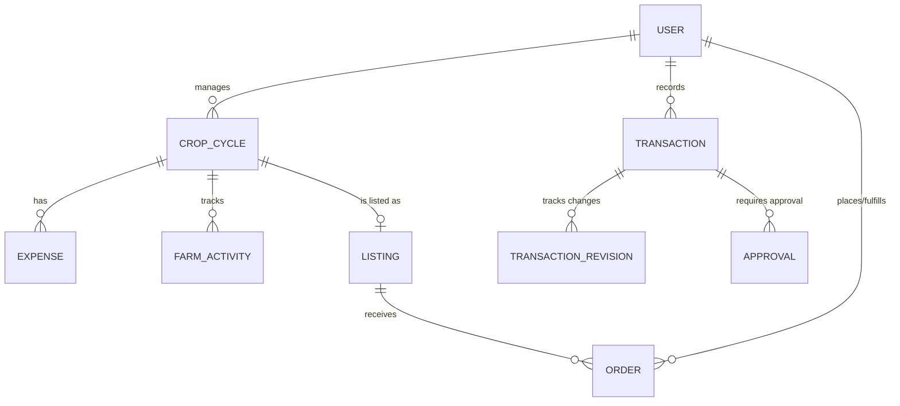

# 🌾 AGRO TRACK: Farmer Ledger & Marketplace
### *A Comprehensive Project Report and Documentation for Academic and Professional Binding*

---

## 📖 Table of Contents
1. **Abstract**
2. **Introduction & Motivation**
   * 2.1 Problem Statement
   * 2.2 Proposed Solution
   * 2.3 Scope of the Project
3. **System Architecture**
   * 3.1 Overall System Design
   * 3.2 Frontend Architecture (Client-Side)
   * 3.3 Backend Architecture (Server-Side)
   * 3.4 Real-time Communication (WebSocket Flow)
4. **Database Design & Data Models**
   * 4.1 Schema Overview & Relationships
   * 4.2 Entity Definitions (Mongoose Models)
5. **Key Modules & Core Features**
   * 5.1 Authentication & Role-Based Access Control
   * 5.2 Mutual Transaction Ledger (Invoice Approval)
   * 5.3 Farm Management (Crop Cycles, Expenses & Chores)
   * 5.4 Inventory Control & Alert System
   * 5.5 Marketplace & Order Management System
   * 5.6 Agronomy Decision Center & AI Services
6. **Detailed API Reference**
7. **System Security & Performance**
   * 7.1 Security Implementations
   * 7.2 Performance Optimization Strategies
8. **Deployment & Technical Stack**
   * 8.1 Core Technology Stack
   * 8.2 Local Setup and Configuration
   * 8.3 Production Deployment Plan (Render Monolith)
9. **Conclusion & Future Enhancements**

---

## 1. Abstract
The agricultural sector forms the backbone of global economies, yet farmers continue to face challenges due to opaque marketplaces, lack of record-keeping tools, volatile pricing, and high intermediary costs. **Agro Track** is a full-stack Web Application designed to solve these systemic inefficiencies. Developed using the MERN stack (MongoDB, Express, React, Node.js), Agro Track introduces a dual-sided ecosystem catering to both **Farmers** and **Buyers**.

At its core, Agro Track implements an **Immutable Mutual Ledger** that resolves disputes between counterparties by enforcing a dual-signature approval workflow for all transactions and invoice amendments. Additionally, it integrates a **Farm Management Suite** tracking crop cycles, expenses, and farm activities, paired with a **Marketplace** that permits direct peer-to-peer commerce using a secure Cash-on-Delivery (COD) 6-digit verification workflow. Finally, the app features an **AI-Driven Agronomy Decision Center** providing real-time weather alerts, crop-specific growth suggestions, dynamic market price analysis, crop yield predictions, and an organic plant disease diagnosis simulation.

---

## 2. Introduction & Motivation

### 2.1 Problem Statement
1. **Inefficient Ledger Tracking**: Smallholder farmers frequently conduct transactions based on verbal agreements or loose paper slips. This lack of auditability leads to payment delays and dispute resolution issues.
2. **Price Exploitation by Intermediaries**: Farmers often lack direct access to retail buyers, leaving them vulnerable to middlemen who squeeze margins.
3. **Lack of Digitized Crop Planning**: Sowing, harvesting, and expensing are managed manually. Farmers miss out on forecasting metrics, leading to poor cash-flow tracking.
4. **Scarcity of Advisory Services**: Local agronomy consulting is expensive and inaccessible. Farmers struggle to determine yield predictions, select seed varieties, identify diseases, and plan harvests around weather forecasts.

### 2.2 Proposed Solution
**Agro Track** acts as a unified digital platform addressing these challenges:
* **Mutual Approval Workflows**: Invoices logged by either party are held in a pending state until reviewed and approved by the counterparty, creating a mutually validated invoice.
* **Direct Farmer-to-Buyer Marketplace**: Disintermediates the supply chain by allowing farmers to list fresh harvests directly and allowing buyers to browse, preview shipping charges, and place orders.
* **Agronomy Advisory Tools**: Brings enterprise-grade agricultural intelligence (weather alerts, disease classification, and machine learning crop yield forecasts) directly to rural users.

### 2.3 Scope of the Project
The application caters to three roles:
1. **Farmers**: Can manage crop cycles, track expenses, log activities, list crops on the marketplace, fulfill orders, access the agronomy decision center, and log mutual invoices.
2. **Buyers**: Can search local farmers, browse listings, check out with automatically calculated shipping fees, track orders, and approve mutual invoices.
3. **Admins**: Can configure system-wide constants, adjust global shipping tier prices, and monitor overall transaction volume.

---

## 3. System Architecture

### 3.1 Overall System Design
Agro Track uses a modern Client-Server architecture pattern:

```mermaid
graph TD
    User["Client App (React + Zustand)"] <-->|REST API / HTTP Secure Cookies| Express["Express Server (Node.js)"]
    User <-->|WebSockets (Socket.IO-Client)| WebSockets["WebSockets Event Layer (Socket.IO)"]
    Express <-->|Database Queries| MongoDB[("MongoDB Atlas (Mongoose ORM)")]
    Express <-->|Weather Feeds| OpenMeteo["Open-Meteo API"]
    WebSockets <--> Express
```

In production, the architecture operates as a **unified monolith** where the Express server serves both the JSON API endpoints and compiles the static client React assets (`client/dist`) from the same environment, minimizing deployment costs and eliminating cross-origin cookie issues.

### 3.2 Frontend Architecture (Client-Side)
* **Framework**: React (v18) built with Vite for blazing-fast hot module replacement.
* **State Management**: **Zustand** is utilized for global reactive states (authentication, real-time alerts, shopping carts, and websocket instances).
* **Routing**: React Router DOM (v6) with declarative layout routing, route guards (`ProtectedRoute` for logged-in users, `FarmerRoute`/`BuyerRoute` for specific roles).
* **Visual Components**: Custom styling via Vanilla CSS variables, combined with `react-icons` for modern visuals and **Recharts** for analytics rendering.

### 3.3 Backend Architecture (Server-Side)
* **Runtime**: Node.js utilizing ES Modules (`import/export` syntax).
* **Framework**: Express.js with a modular controller-service-route architecture.
* **Middlewares**:
  * `auth.middleware.js`: Validates the `token` cookie using JWT.
  * `error.middleware.js`: Centralized try-catch wrapper returning standardized `{ success, message, data }` responses.
  * `express-rate-limit`: Protects sensitive login/register routes against brute-force attacks.
  * `helmet`: Configures security headers to shield the backend from common web vulnerabilities.
  * `cookie-parser`: Parses HTTP cookies containing the JWT auth tokens.

### 3.4 Real-time Communication (WebSocket Flow)
Real-time communication is established via **Socket.IO**:
1. When a user logs in, the client establishes a persistent connection.
2. The server binds the socket connection to a room named after the authenticated `userId`.
3. When a transaction status changes or a new order is received, the server queries the counterparty's room and pushes a JSON event payload.
4. The client's Zustand notification store receives the event and displays a custom toast notification in real time.

---

## 4. Database Design & Data Models

### 4.1 Schema Overview & Relationships
Agro Track uses a document database (MongoDB). Relational integrity is enforced using Mongoose ObjectIds and ref configurations.



### 4.2 Entity Definitions (Mongoose Models)

#### 1. User (`User.model.js`)
Stores system user profiles, authorization roles, reputations, and default delivery coordinates.
* **Fields**:
  * `name`, `email`, `phone`, `passwordHash` (stored as bcrypt hash)
  * `role`: String (Enum: `FARMER`, `BUYER`, `ADMIN`)
  * `location`, `latitude`, `longitude`: Used for live weather lookup and buyer proximity estimation.
  * `experienceYears`, `bio`: Profile bio details.
  * `trustScore` (1.0 to 5.0), `ratingsCount`, `ratingsSum`: Calculated average review stars.
  * Address properties (`fullName`, `addressLine1`, `city`, `district`, `state`, `postalCode`).
  * `accountStatus`: Enum (`ACTIVE`, `BLOCKED`, `SUSPENDED`).

#### 2. CropCycle (`CropCycle.model.js`)
Tracks the lifecycle of a particular crop growing in a field.
* **Fields**:
  * `farmerId`: ObjectId (ref: `User`)
  * `cropName`, `description`, `seasonYear`, `startDate`, `endDate`
  * `status`: Enum (`ACTIVE`, `COMPLETED`, `CANCELLED`)
  * `cropStatus`: Enum (`GROWING`, `READY_FOR_HARVEST`, `AVAILABLE_FOR_SALE`, `RESERVED`, `SOLD`)
  * `growthStage`: Enum (`SEEDLING`, `VEGETATIVE`, `FLOWERING`, `YIELDING`, `HARVESTED`)
  * `area` (acres), `expectedHarvestDate`, `seedVariety`, `location` (field name)
  * `availableQuantity`, `pricePerUnit`, `investmentAmount`
  * `growthStageLog`: Sub-document array logging history of stage changes.
  * `stageReminders`: Sub-document array of chores (e.g., watering).

#### 3. Expense (`Expense.model.js`)
Tracks cash outflows for a crop cycle.
* **Fields**:
  * `cropCycleId`: ObjectId (ref: `CropCycle`)
  * `farmerId`: ObjectId (ref: `User`)
  * `category`: Enum (`SEEDS`, `FERTILIZERS`, `PESTICIDES`, `LABOR`, `MACHINERY`, `IRRIGATION`, `OTHER`)
  * `amount`: Number (min 0)
  * `spentOnDate`: Date
  * `description`, `vendor`, `quantity`, `unit`, `note`

#### 4. Transaction (`Transaction.model.js`)
The shared mutual ledger document.
* **Fields**:
  * `farmerId`: ObjectId (ref: `User`), `buyerId`: ObjectId (ref: `User`)
  * `cropCycleId`: ObjectId (ref: `CropCycle`)
  * `quantity`, `unit`, `pricePerUnit`, `totalAmount`, `transactionDate`
  * `paymentStatus`: Enum (`DUE`, `PARTIALLY_PAID`, `PAID`)
  * `amountPaid`, `amountDue`
  * `status`: Enum (`PENDING`, `FINAL`, `REJECTED`)
  * `createdByUserId`: ObjectId (ref: `User`)
  * Ratings: `buyerRatingOfFarmer`, `farmerRatingOfBuyer`, comments.

#### 5. Listing (`Listing.model.js`)
Marketplace products advertised to buyers.
* **Fields**:
  * `farmerId`, `cropCycleId`
  * `title`, `description`, `cropName`
  * `category`, `pricePerUnit`, `unit`, `quantity` (stock count)
  * `status`: Enum (`DRAFT`, `ACTIVE`, `SOLD_OUT`, `INACTIVE`)
  * `views`: Track buyer clicks.

#### 6. Order (`Order.model.js`)
Marketplace checkout orders.
* **Fields**:
  * `buyerId`, `farmerId`, `listingId`, `cropCycleId`
  * `productName`, `quantity`, `unit`
  * `pricePerUnit`, `subtotal`, `deliveryCharge`, `handlingCharge`, `grandTotal`
  * Delivery address snapshots
  * `deliveryCode`: 6-digit code (hashed or hidden from direct responses)
  * `status`: Enum (`PENDING`, `ACCEPTED`, `REJECTED`, `OUT_FOR_DELIVERY`, `DELIVERED`, `CANCELLED`)

---

## 5. Key Modules & Core Features

### 5.1 Authentication & Role-Based Access Control
Security is built around JWT. Upon logging in, the server generates a token signing the user's ID and role, and attaches it as an `httpOnly`, `SameSite=Lax` cookie. This prevents Cross-Site Scripting (XSS) client-side reads. Client routes inspect the state to dynamically lock/unlock navigation menus.

### 5.2 Mutual Transaction Ledger (Invoice Approval)
To prevent one-sided invoice changes, the ledger enforces a **state-machine validation flow**:

```text
Draft logged by Farmer  ──>  Transaction status: PENDING
                                  │
                  ┌───────────────┴───────────────┐
                  ▼                               ▼
            Buyer Approves                  Buyer Rejects
                  │                               │
                  ▼                               ▼
       Transaction status: FINAL       Transaction status: REJECTED
       (Locked; immutable record)       (Allows modification & re-review)
```
If a record requires modification, the edit route saves the previous data to the `TransactionRevision` schema and resets the status back to `PENDING` for a new review signature.

### 5.3 Farm Management (Crop Cycles, Expenses & Chores)
Farmers create separate entries for each crop cycle. The system links all corresponding operational costs (fertilizer purchases, labor wages) logged under the `expenses` module to calculate the total investment. This allows the system to subtract total input costs from final marketplace sales, displaying exact profit-and-loss (P&L) trends in dashboard charts.

### 5.4 Inventory Control & Alert System
Farmers manage stocks of fertilizers, pesticides, seeds, and equipment. The database schema monitors:
* Current Stock vs. Minimum Threshold levels.
* Low stock levels trigger dashboard warnings to ensure the farmer replenishes vital resources before starting a new crop stage.

### 5.5 Marketplace & Order Management System
* **Checkout Calculator**: When a buyer adds a listing to their cart, the system calculates shipping weights and matches them to configurations seeded in `DeliveryConfig.model.js`.
* **Security Code Delivery Verification**: To ensure buyers do not claim non-delivery, a 6-digit verification code (`deliveryCode`) is generated upon placing an order. The buyer must verbally give this code to the farmer/delivery agent upon arrival. The agent enters the code in the app, validating the transaction on the database and changing the order status to `DELIVERED`.

### 5.6 Agronomy Decision Center & AI Services
* **Live Weather Integration**: Connects to the **Open-Meteo API** using the user's location coordinates. It filters climate statistics to provide real-time warnings (e.g. "Rain expected in 24 hours: do not apply fertilizer").
* **Crop Yield Predictor**: Simulates a Random Forest regression model (`AgroTrack-RF-Regress-v1.2`) that evaluates the acreage, seed variety multiplier, and crop characteristics to output expected harvests with 88% confidence.
* **AI Agronomy Bot**: Evaluates active crop cycles for the logged-in farmer and provides answers to fertilization, watering, or crop rotation queries, simulating LLM actions.
* **Crop Disease Detector**: Simulates a CNN classification model. The user uploads an image of a leaf; the backend parses the file name (e.g., matching keywords like `spot`, `wilt`, `rust`) to diagnose common diseases and lists actionable organic treatments (e.g., spraying Neem seed kernel extracts).

---

## 6. Detailed API Reference

| Domain | Method | Endpoint | Access Role | Description |
|---|---|---|---|---|
| **Auth** | POST | `/api/auth/register` | Public | Registers a new account |
| | POST | `/api/auth/login` | Public | Authenticates and sets session cookie |
| | POST | `/api/auth/logout` | Authenticated | Clears cookies |
| | GET | `/api/auth/me` | Authenticated | Retrieves current session user |
| **Ledger** | GET | `/api/transactions` | Authenticated | Retrieves page-wise transaction lists |
| | POST | `/api/transactions` | Authenticated | Inserts a new pending transaction invoice |
| | PUT | `/api/transactions/:id` | Authenticated | Edits transaction details (resets approval status) |
| | POST | `/api/approvals/:id/approve`| Counterparty | Digitally signs/closes a transaction (`FINAL`) |
| | POST | `/api/approvals/:id/reject` | Counterparty | Rejects the proposed ledger invoice |
| | GET | `/api/transactions/:id/revisions`| Authenticated | Queries audit log history for a transaction |
| **Crops** | GET | `/api/crop-cycles` | Farmer | Returns active and past crop cycles |
| | POST | `/api/crop-cycles` | Farmer | Creates a new crop cultivation log |
| | GET | `/api/crop-cycles/:cropCycleId/activities` | Farmer | Lists chore entries for the cycle |
| **Market** | GET | `/api/listings` | Public | Lists all active crop marketplace offers |
| | POST | `/api/orders` | Buyer | Submits checkout cart for order creation |
| | POST | `/api/orders/:id/verify-delivery` | Farmer | Confirms dispatch via the 6-digit buyer code |
| **Advisory**| GET | `/api/agronomy/weather` | Authenticated | Returns lat/lon forecast details |
| | GET | `/api/agronomy/market-prices` | Authenticated | Returns pricing indices and price trend histories |
| | POST | `/api/agronomy/ai/chat` | Authenticated | Processes chatbot agronomy requests |
| | POST | `/api/agronomy/ai/disease-detect` | Authenticated | Returns leaf disease diagnoses |

---

## 7. System Security & Performance

### 7.1 Security Implementations
1. **HttpOnly Cookie Store**: By storing JWT tokens in cookies configured with `httpOnly` and `SameSite=Lax`, the client application prevents malicious scripts from accessing session tokens, neutralising Cross-Site Scripting (XSS) extraction attacks.
2. **Password Cryptography**: Passwords undergo one-way hashing with **bcryptjs** (using a work factor/salt rounds of 10) before database storage.
3. **Rate Limiting**: Sensitve authentication entry points (`/api/auth/login` and `/api/auth/register`) utilize middleware limiting requests to 20 attempts per 15-minute window, blocking automated brute-force attacks.
4. **CORS Security**: Cross-Origin Resource Sharing is set to accept connection requests exclusively from registered origin domains defined in environment configurations.
5. **NoSQL Injection Shielding**: Express endpoints process JSON data schemas verified using **Zod** models, filtering out unauthorized database injection fields.

### 7.2 Performance Optimization Strategies
* **Database Indexes**: Index strategies are configured on high-read fields (`role`, `createdAt`, `farmerId`, `buyerId`, and `status`) to ensure quick lookup times as the document collection grows.
* **Advisory Caching**: External weather feeds (Open-Meteo) and calculated pricing statistics are cached in server memory. Open-Meteo forecasts remain cached for 15 minutes, and market index tables remain cached for 10 minutes, saving bandwidth and lowering API overhead.

---

## 8. Deployment & Technical Stack

### 8.1 Core Technology Stack
* **Frontend**: React (v18), Vite, Zustand, Recharts, React Router DOM.
* **Backend**: Node.js, Express, Socket.IO, Cookie-Parser, Mongoose, Zod, Bcryptjs.
* **Database**: MongoDB Atlas.

### 8.2 Local Setup and Configuration
1. **Install Dependencies**: Run the install script from the workspace root:
   ```bash
   npm run install:all
   ```
2. **Setup Server Environment**: In `/server`, create a `.env` file:
   ```env
   PORT=8080
   MONGO_URL=mongodb+srv://<user>:<pwd>@cluster.mongodb.net/agro_track
   JWT_SECRET=super_secret_signing_key_32_chars
   JWT_EXPIRES_IN=7d
   CORS_ORIGINS=http://localhost:5173
   COOKIE_SECURE=false
   ```
3. **Setup Client Environment**: In `/client`, create a `.env` file:
   ```env
   VITE_API_URL=/api
   ```
4. **Boot Development Engines**: In separate terminal interfaces:
   ```bash
   npm run dev:server
   npm run dev:client
   ```

### 8.3 Production Deployment Plan (Render Monolith)
For production hosting on platforms like Render:
1. The client bundle is generated using Vite:
   ```bash
   npm run build:client
   ```
   This generates compiled HTML/JS/CSS assets inside `client/dist`.
2. The server application is configured to serve static directories:
   ```javascript
   app.use(express.static(path.join(__dirname, '../../client/dist')));
   app.get('*', (req, res) => {
     res.sendFile(path.join(__dirname, '../../client/dist/index.html'));
   });
   ```
3. Environmental settings are updated:
   * `NODE_ENV=production`
   * `COOKIE_SECURE=true` (forces JWT cookie delivery only over encrypted HTTPS links).
   * `CORS_ORIGINS` is updated to matches the deployed Render hostname.

---

## 9. Conclusion & Future Enhancements
Agro Track demonstrates the power of modern MERN stack development in addressing real-world agricultural problems. By digitizing crop cycles and ledger books, it removes financial ambiguity, while its integrated marketplace and agronomy decision center empower small-scale farmers to compete in modern agricultural landscapes.

### Future Roadmap
1. **Blockchain Integration**: Migrate the transaction mutual ledger from a centralized database schema to a decentralized Hyperledger or Solidity smart-contract network to guarantee absolute immutability.
2. **IoT Integration**: Integrate smart soil moisture and NPK sensor arrays to stream live readings directly into the Crop Cycle panel, replacing manual growth stage logging.
3. **True ML Models**: Replace simulated yield prediction and disease analysis endpoints with production-ready PyTorch CNN classifiers and Scikit-Learn regressors hosted on specialized microservices.
